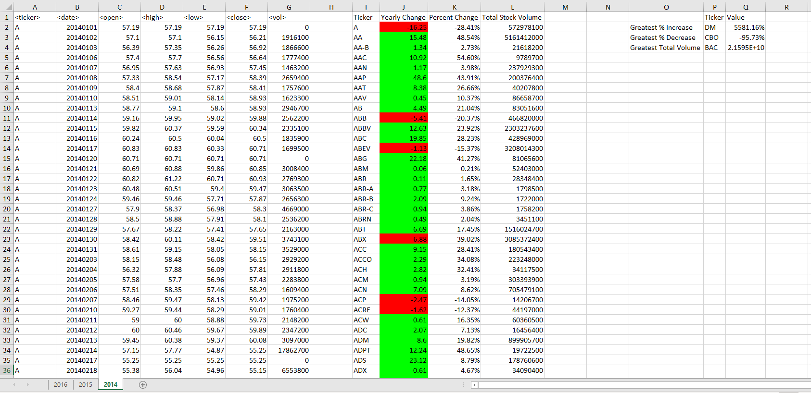
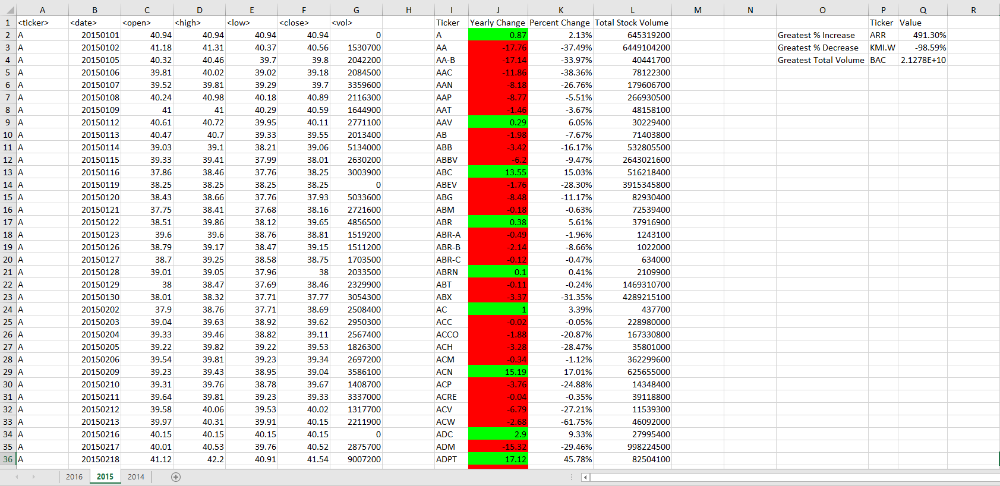
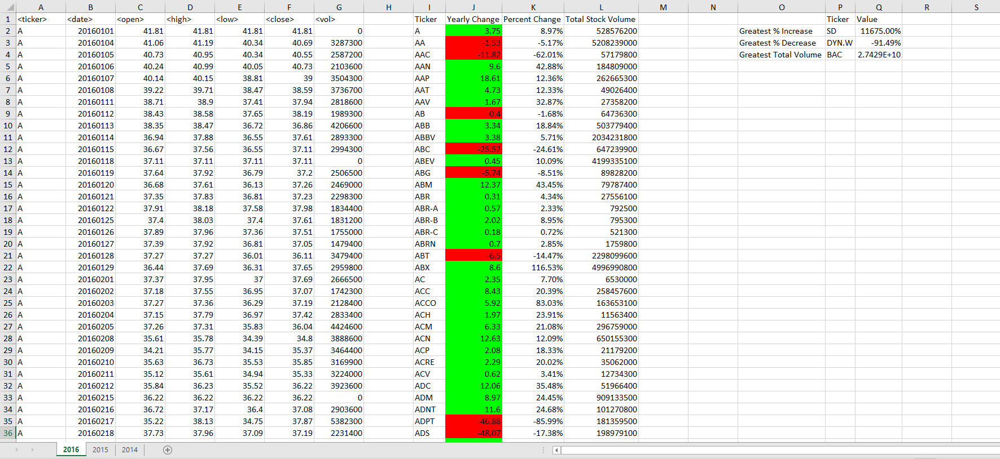

# Stock Market Analysis

## Overview of the Project
A VBA script which analyses three years worth of stock data from 2014 to 2016. 
It then calculates the following for each stock
- the yearly change from opening price at the beginning of a given year to the closing price at the end of that year.
- the percent change from opening price at the beginning of a given year to the closing price at the end of that year.
- the total stock volume of the stock.

I also calculates which stock showed the greatest increase, decrease, and change in trading volume for that year.

**2014**

 

**2015**

 

**2016**

 

## Tools/Packages used
- Excel
- VBA

 

## How to use
- Download the repository.
- Open the `Multi Year Stock Data Analysis.bas` file in a text editor and copy the code.
- Paste the code into an empty Excel Macro in the [excel file](data/Multiple_year_stock_data.xlxs) provided.
- Run the code.
